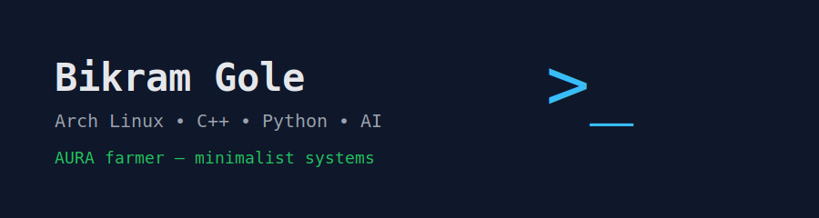

<p align="center">

</p>

<p align="center">

</p>

<h2 align="center">Bikram Gole — AURA farmer</h2>
<p align="center">
Minimalist systems • Arch Linux • C++ • Python • AI tools
</p>

---

# About Me

I like **minimal systems that do exactly what they should — nothing more**.

I spend most of my time experimenting with:

* Linux customization
* lightweight development tools
* small CLI utilities
* AI-assisted workflows

I learn primarily through **AI tools and YouTube deep dives**, then apply the ideas by building small experiments.

Software should be **free — as in freedom**.

---

# Tech I Use


Core environment:

* **Arch Linux**
* **Fish shell**
* **QuickShell DMS (Dank Material Shell)**
* **C++**
* **Python**
* **Git**
* **Micro editor**
* **mpv**
* **LibreWolf**

---

# Terminal Snapshot

```
neo@arch:~$ fastfetch

OS: Arch Linux
Shell: fish
Terminal: foot
WM: Hyprland
Shell UI: QuickShell DMS

Languages:
- C++
- Python

Focus:
- AI tools
- minimal systems
- Linux customization
```

---

# What I'm Currently Building

* **Dotfiles & system configs**
* **Small C++ CLI utilities**
* **Python tools for AI workflows**
* Experiments in **minimal operating environments**

Long term interest:

> Designing a personal **custom OS ecosystem** and minimal computing stack.

---

# Fun Facts

* I intentionally **break configs to understand them**.
* I prefer **minimal tools that do one thing well**.
* I believe **open source is the backbone of innovation**.
* I run Arch Linux — *yes, btw.*

---

# GitHub Stats

<p align="center">

</p>

<p align="center">

</p>

---

# Example Workflow

Typical setup steps on a new system:

```bash
# update system
sudo pacman -Syu

# install tools
sudo pacman -S git fish micro fastfetch mpv librewolf

# python tooling
sudo pacman -S python-pipx
pipx ensurepath
```

---

# Connect

Website
https://DevXtechnic.github.io

Email
[Bikramgole.genius@keemail.me](mailto:Bikramgole.genius@keemail.me)

---

# Philosophy

> Build simple systems.
> Understand them deeply.
> Automate the boring parts.
> Stay curious.
